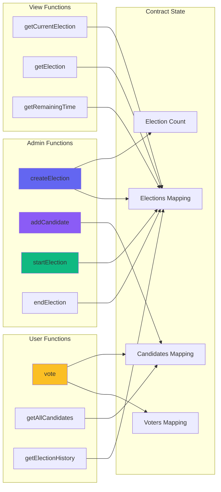

# Blockchain Voting System - Backend

Smart contracts and blockchain infrastructure for the decentralized voting system.

## 📁 Structure

```
backend/
├── contracts/          # Solidity smart contracts
│   └── Voting.sol     # Main voting contract
├── scripts/           # Deployment scripts
│   └── deploy.js      # Contract deployment
├── hardhat.config.js  # Hardhat configuration
└── package.json       # Dependencies
```

## 🚀 Setup

1. **Install Dependencies**
```bash
npm install
```

2. **Start Local Blockchain**
```bash
npx hardhat node
```

3. **Deploy Contract** (in new terminal)
```bash
npx hardhat run scripts/deploy.js --network localhost
```

4. **Copy Contract Address**
   - After deployment, copy the contract address
   - Update `frontend/.env` with the new address

## 📝 Smart Contract Features

- ✅ Multiple elections support
- ✅ Election history tracking
- ✅ Candidate management
- ✅ Secure voting mechanism
- ✅ Time-based election control
- ✅ Owner-only admin functions

## � Smart Contract Architecture



## �🔧 Development

**Compile Contracts:**
```bash
npx hardhat compile
```

**Run Tests:**
```bash
npx hardhat test
```

**Clean Build:**
```bash
npx hardhat clean
```

## 📦 Dependencies

- Hardhat - Ethereum development environment
- Ethers.js - Ethereum library
- Solidity ^0.8.0 - Smart contract language
