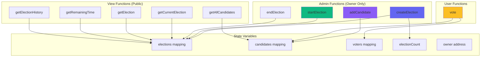

# 🔗 Blockchain Voting System - Backend

Smart contracts and blockchain infrastructure for the decentralized voting system built with Hardhat and Solidity.

## 📋 Overview

This backend provides the blockchain layer for a secure, transparent, and immutable voting system. The smart contract handles election creation, candidate management, voting logic, and result tracking.

## 📁 Project Structure

```
backend/
├── contracts/
│   └── Voting.sol              # Main voting smart contract
├── scripts/
│   └── deploy.ts               # Contract deployment script
├── artifacts/                  # Compiled contract artifacts (auto-generated)
├── cache/                      # Hardhat cache (auto-generated)
├── hardhat.config.ts           # Hardhat configuration
├── tsconfig.json               # TypeScript configuration
├── package.json                # Dependencies
└── README.md                   # This file
```

## 🚀 Quick Start

### Prerequisites

- Node.js v18 or higher
- npm or yarn

### Installation

```bash
# Install dependencies
npm install
```

### Start Local Blockchain

```bash
# Start Hardhat local network
npx hardhat node
```

This will:
- Start a local Ethereum network on `http://127.0.0.1:8545`
- Create 20 test accounts with 10,000 ETH each
- Display account addresses and private keys

**Keep this terminal running!**

### Deploy Smart Contract

In a new terminal:

```bash
# Deploy to localhost
npx hardhat run scripts/deploy.ts --network localhost
```

**Output:**
```
Voting contract deployed to: 0x5FbDB2315678afecb367f032d93F642f64180aa3
```

📝 **Important:** Copy this contract address and update it in `frontend/.env`

## 📝 Smart Contract Features

### Core Functionality

- ✅ **Multiple Elections Support** - Create unlimited elections
- ✅ **Election History** - Complete blockchain-based history
- ✅ **Candidate Management** - Add/track candidates per election
- ✅ **Secure Voting** - One vote per address per election
- ✅ **Time-Based Control** - Automatic election expiry
- ✅ **Owner-Only Admin** - Restricted admin functions
- ✅ **Live Vote Tracking** - Real-time vote counts
- ✅ **Winner Determination** - Automatic winner calculation

### Smart Contract Architecture



## 🔧 Smart Contract API

### Admin Functions (Owner Only)

#### `createElection(string name)`
Creates a new election with the given name.
- **Parameters:** `name` - Election name
- **Returns:** `electionId` - ID of created election
- **Emits:** `ElectionCreated(electionId, name)`

#### `addCandidate(uint256 electionId, string name)`
Adds a candidate to an election.
- **Parameters:** 
  - `electionId` - Target election ID
  - `name` - Candidate name
- **Emits:** `CandidateAdded(electionId, candidateId, name)`

#### `startElection(uint256 electionId, uint256 duration)`
Starts an election with specified duration.
- **Parameters:**
  - `electionId` - Election to start
  - `duration` - Duration in minutes
- **Requirements:** At least 2 candidates
- **Emits:** `ElectionStarted(electionId, endTime)`

#### `endElection(uint256 electionId)`
Manually ends an active election.
- **Parameters:** `electionId` - Election to end
- **Emits:** `ElectionEnded(electionId)`

### User Functions

#### `vote(uint256 electionId, uint256 candidateId)`
Cast a vote in an active election.
- **Parameters:**
  - `electionId` - Target election
  - `candidateId` - Chosen candidate
- **Requirements:** 
  - Election must be active
  - User hasn't voted yet
- **Emits:** `VoteCast(electionId, voter, candidateId)`

### View Functions

#### `getCurrentElection()`
Returns the current active election details.

#### `getElection(uint256 electionId)`
Returns details of a specific election.

#### `getAllCandidates(uint256 electionId)`
Returns all candidates for an election with vote counts.

#### `getRemainingTime(uint256 electionId)`
Returns remaining time in seconds for an active election.

#### `getElectionHistory()`
Returns all past elections with results.

## 🔨 Development Commands

### Compile Contracts

```bash
npx hardhat compile
```

Compiles all Solidity contracts and generates:
- Contract artifacts in `artifacts/`
- TypeScript types (if configured)
- ABI files

### Run Tests

```bash
npx hardhat test
```

Runs all test files in the `test/` directory.

### Clean Build

```bash
npx hardhat clean
```

Removes all build artifacts and cache.

### Verify Contract (for testnets/mainnet)

```bash
npx hardhat verify --network <network> <contract-address> <constructor-args>
```

## 🌐 Network Configuration

### Localhost (Default)

```javascript
{
  url: "http://127.0.0.1:8545",
  chainId: 31337,
  accounts: [/* Hardhat test accounts */]
}
```

### Adding Other Networks

Edit `hardhat.config.ts` to add testnets or mainnet:

```typescript
networks: {
  sepolia: {
    url: process.env.SEPOLIA_RPC_URL,
    accounts: [process.env.PRIVATE_KEY],
    chainId: 11155111
  }
}
```

## 📦 Dependencies

### Core Dependencies

- **hardhat** - Ethereum development environment
- **@nomicfoundation/hardhat-toolbox** - Hardhat plugins bundle
- **ethers** - Ethereum library for contract interaction

### Dev Dependencies

- **typescript** - TypeScript support
- **@types/node** - Node.js type definitions

## 🔐 Security Considerations

- ✅ Owner-only modifiers on admin functions
- ✅ Reentrancy protection (no external calls)
- ✅ Input validation on all functions
- ✅ Double-voting prevention
- ✅ Time-based access control
- ✅ Immutable vote records

## 🚨 Important Notes

### Test Accounts

**⚠️ WARNING:** Hardhat test accounts are publicly known. **NEVER** send real funds to these addresses on mainnet or testnets.

### Account #0 (Contract Owner)
```
Address: 0xf39Fd6e51aad88F6F4ce6aB8827279cffFb92266
Private Key: 0xac0974bec39a17e36ba4a6b4d238ff944bacb478cbed5efcae784d7bf4f2ff80
```

This account deploys the contract and has admin privileges.

### Redeploying

When you restart the Hardhat node:
1. All previous contract deployments are lost
2. You must redeploy the contract
3. Update the contract address in `frontend/.env`
4. Restart the frontend dev server

## 📊 Gas Optimization

The contract is optimized for:
- Minimal storage operations
- Efficient data structures
- Batch operations where possible
- View functions for read-only data

## 🔄 Deployment Workflow

1. **Start local network:** `npx hardhat node`
2. **Deploy contract:** `npx hardhat run scripts/deploy.ts --network localhost`
3. **Copy contract address** from deployment output
4. **Update frontend** `.env` file with new address
5. **Start frontend** application

## 📖 Additional Resources

- [Hardhat Documentation](https://hardhat.org/docs)
- [Solidity Documentation](https://docs.soliditylang.org/)
- [Ethers.js Documentation](https://docs.ethers.org/v6/)
- [OpenZeppelin Contracts](https://docs.openzeppelin.com/contracts/)

## 🤝 Contributing

When contributing to the smart contract:
1. Write comprehensive tests
2. Follow Solidity style guide
3. Add NatSpec comments
4. Optimize for gas efficiency
5. Consider security implications

## 📄 License

MIT License - See LICENSE file for details

---

**Part of the Blockchain Voting System** | [Main README](../README.md) | [Frontend README](../frontend/README.md)
